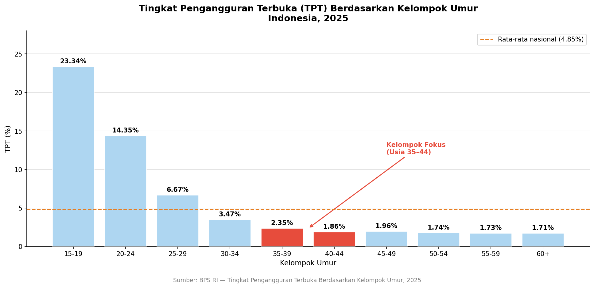
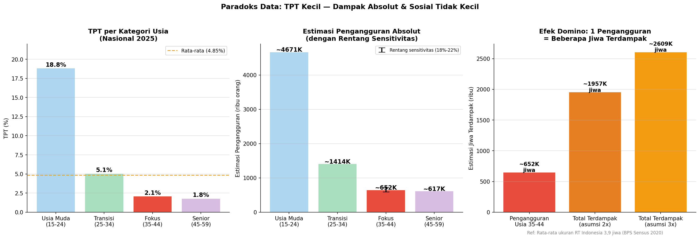
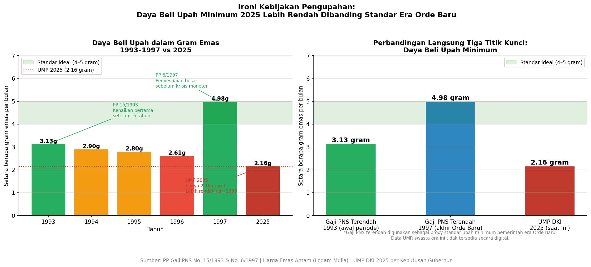

# 📊 EDA: Tingkat Pengangguran Terbuka (TPT) Usia 35–45 Tahun di Indonesia
### *Krisis Ketenagakerjaan Tersembunyi di Balik Angka yang Tampak Kecil*

---

## 🔍 Tentang Project Ini

Project ini adalah **Exploratory Data Analysis (EDA)** yang memotret kondisi ketenagakerjaan kelompok usia 35–45 tahun di Indonesia secara berbasis data. Analisis ini tidak hanya menyajikan angka, tetapi juga menghubungkannya dengan konteks regulasi, daya beli upah, dan proyeksi dampak sosial-ekonomi jangka panjang.

> ⚠️ **Disclaimer:** Analisis ini bersifat deskriptif-eksploratif dan tidak mengklaim hubungan kausalitas. Beberapa bagian menggunakan estimasi dan simulasi yang dijelaskan secara eksplisit.

---

## ❓ Mengapa Topik Ini Penting?

Diskusi ketenagakerjaan Indonesia hampir selalu berfokus pada pengangguran usia muda. Namun ada kelompok yang tersingkir secara sistematis namun jarang disorot: **penduduk usia 35–45 tahun — tulang punggung keluarga Indonesia.**

Paradoks yang terjadi:
- TPT mereka **rendah secara persentase** → tidak terlihat sebagai prioritas kebijakan
- Namun populasinya **sangat besar** → secara absolut dampaknya signifikan
- Mayoritas sudah **berkeluarga dengan tanggungan** → 1 pengangguran = 2–3 jiwa terdampak
- Menghadapi **diskriminasi usia sistemik** di pasar kerja → meski regulasi melarangnya

---

## 📊 Visualisasi Utama

### 1. TPT per Kelompok Umur Nasional (2025)

*TPT usia 35–44 terlihat kecil secara persentase, namun populasinya jutaan orang.*

---

### 2. Paradoks Data: Persentase Kecil — Dampak Absolut & Efek Domino Tidak Kecil

*Satu pengangguran usia 35–44 berpotensi memengaruhi 2–3 jiwa lainnya secara langsung.*

---

### 3. Ironi Kebijakan Pengupahan: Daya Beli UMP 2025 vs Era Orde Baru

*UMP 2025 (2,16 gram emas) lebih rendah daya belinya dibanding gaji PNS terendah tahun 1993 (3,13 gram emas).*

---

## 📁 Struktur Project

```
EDA_TPT_Nasional_3545/
├── README.md
├── requirements.txt
├── .gitignore
├── notebook/
│   └── EDA_TPT_Nasional_3545.ipynb   # Notebook utama
├── data/
│   ├── tpt_nasional_2025.csv          # TPT per kelompok umur (BPS 2025)
│   ├── penduduk_15plus_nasional_2026.csv  # Angkatan kerja nasional (BPS Feb 2026)
│   └── gaji_pns_vs_emas_1993_2025.csv    # Data historis gaji PNS vs harga emas
└── output/
    ├── viz_01_tpt_per_kelompok_umur.png
    ├── viz_02_paradoks_dan_domino.png
    ├── viz_03_gap_regulasi_realita.png
    ├── viz_04_ump_vs_kebutuhan.png
    ├── viz_05_daya_beli_emas_historis.png
    └── viz_06_proyeksi_skenario.png
```

---

## 📌 Struktur Analisis

| Bagian | Topik |
|---|---|
| 1 | Persiapan Data — Load, cek kualitas, transformasi |
| 2 | Analisis TPT Usia 35–45 Nasional — paradoks persentase vs absolut |
| 3 | Konteks Hukum — Regulasi vs realita di lapangan |
| 4 | Analisis Upah — UMP vs daya beli riil kepala keluarga |
| 5 | Analisis Historis — Daya beli upah dalam standar gram emas |
| 6 | Proyeksi Dampak — Dua skenario ilustratif 2025–2030 |
| 7 | Opini Penulis — Pengalaman empiris sebagai pencari kerja usia 35+ |
| 8 | Ringkasan & Rekomendasi Kebijakan |

---

## 🗂️ Sumber Data

| Dataset | Sumber | Tahun |
|---|---|---|
| TPT per Kelompok Umur | BPS RI | 2025 |
| Penduduk 15+ Menurut Jenis Kegiatan | BPS RI | Februari 2026 |
| Gaji Pokok PNS | PP No. 15/1993 & PP No. 6/1997 | 1993–1997 |
| Harga Emas per Gram | Logam Mulia Antam | 1993–2025 |
| UMP DKI Jakarta | Kementerian Ketenagakerjaan RI | 2021–2026 |

> **Catatan:** Data UMR swasta era Orde Baru (1993–1997) tidak tersedia secara digital. Gaji pokok PNS digunakan sebagai proxy standar upah minimum pemerintah pada periode tersebut.

---

## ⚖️ Referensi Regulasi

- UUD 1945 Pasal 27 ayat (2)
- UU No. 13 Tahun 2003 tentang Ketenagakerjaan
- UU No. 39 Tahun 1999 tentang Hak Asasi Manusia
- SE Menaker No. M/6/HK.04/V/2025 tentang Larangan Diskriminasi dalam Rekrutmen
- PP No. 51 Tahun 2023 tentang Pengupahan
- Konvensi ILO No. 111 Tahun 1958

---

## 🚀 Cara Menjalankan Notebook

### Google Colab (Direkomendasikan)

1. Upload seluruh folder ke Google Drive
2. Buka `notebook/EDA_TPT_Nasional_3545.ipynb` di Google Colab
3. Sesuaikan `BASE_PATH` di cell pertama dengan lokasi folder di Drive kamu:
   ```python
   BASE_PATH = '/content/drive/MyDrive/EDA_TPT_Nasional_3545'
   ```
4. Jalankan semua cell secara berurutan (`Runtime > Run all`)

### Lokal

```bash
git clone https://github.com/whddarmadi/EDA_TPT_Nasional_3545.git
cd EDA_TPT_Nasional_3545
pip install -r requirements.txt
jupyter notebook notebook/EDA_TPT_Nasional_3545.ipynb
```

> Jika menjalankan secara lokal, hapus atau skip cell `drive.mount()` dan sesuaikan `BASE_PATH` menjadi path relatif: `BASE_PATH = '../'`

---

## 📦 Dependencies

```
pandas
numpy
matplotlib
seaborn
jupyter
```

Lihat `requirements.txt` untuk versi lengkap.

---

## 🔮 Rencana Pengembangan

Project ini adalah bagian pertama dari rangkaian penelitian ketenagakerjaan:

| # | Project | Status |
|---|---|---|
| 1 | EDA TPT Nasional Usia 35–45 | ✅ Selesai |
| 2 | Scraping & Analisis Lowongan Kerja — Prevalensi diskriminasi usia & gaji di bawah UMP | 🔄 Berikutnya |
| 3 | Analisis Ekosistem Outsourcing — Proporsi lowongan outsourcing vs rekrutmen langsung | ⏳ Direncanakan |

---

## 👤 Tentang Penulis

**Wahid Setio Darmadi**
- GitHub: [github.com/whddarmadi](https://github.com/whddarmadi)
- Bootcamp: Indonesia AI — Batch 10
- Latar belakang: 10+ tahun blogging, multimedia, dan kini beralih ke Data Science & AI

Project ini lahir bukan hanya sebagai portfolio — tetapi sebagai upaya mendokumentasikan ketidakadilan sistemik yang dialami oleh jutaan pekerja Indonesia usia 35–45 tahun, dengan harapan data dapat menjadi suara yang lebih kuat dari sekadar keluhan.

---

## 📄 Lisensi

Data bersumber dari BPS RI dan BPS DKI Jakarta — digunakan sesuai ketentuan data publik untuk keperluan analisis non-komersial.

---

*"Data bukan sekadar angka — ia adalah cerminan dari jutaan kehidupan yang layak untuk diperjuangkan."*
